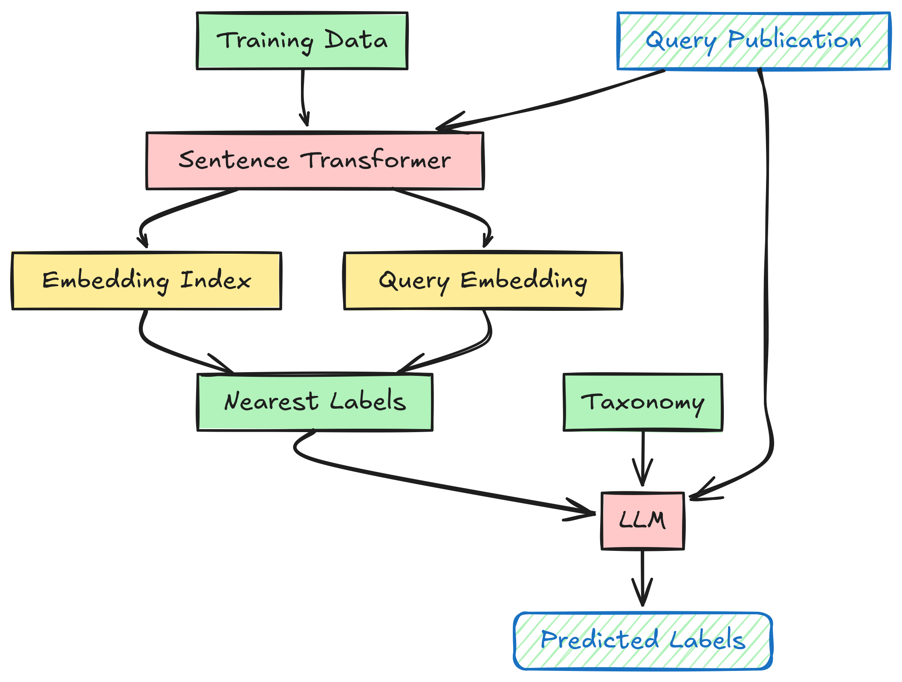

# DICE-FoRC25
This is the accompanying code for our work titled: *From Nearest Neighbors to LLMs: A Hybrid Zero-Shot Approach to Multi-Label Classification* for the shared task of [Field of Research Classification](https://nfdi4ds.github.io/nslp2025/docs/forc_shared_task.html) at the [Natural Scientific Language Processing and Research Knowledge Graphs (NLSP2025)](https://nfdi4ds.github.io/nslp2025/) co-hosted with ESWC2025. 


Our best-performing model involves using a 𝑘-NN model to fetch candidate labels for a query sample, followed by an LLM model for prediction. Conceptually the model could be used for any text-based classification model, probably would work better for multi-label cases.

A workflow diagram of the proposed approach is shown below: 


For the FoRC data one can run:

```cmd
python forc_hybrid.py
```

The data for the task were downloaded from the [corresponding zenodo link](https://zenodo.org/records/14901529).

You could also try this model in any text-classification task. Check out the corresponding *demo.ipynb* for example code.


To be updated. For any questions/details feel free to reach out!